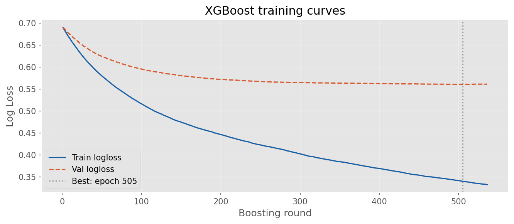
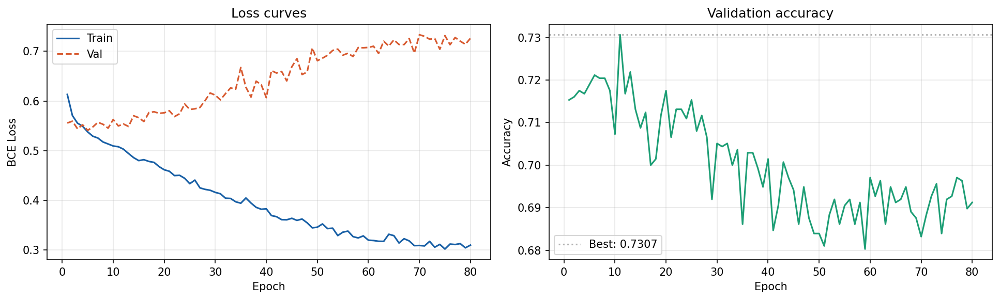
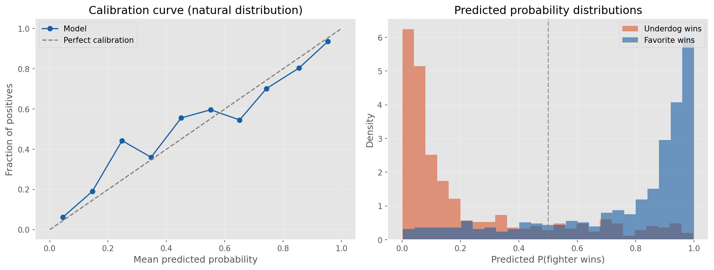
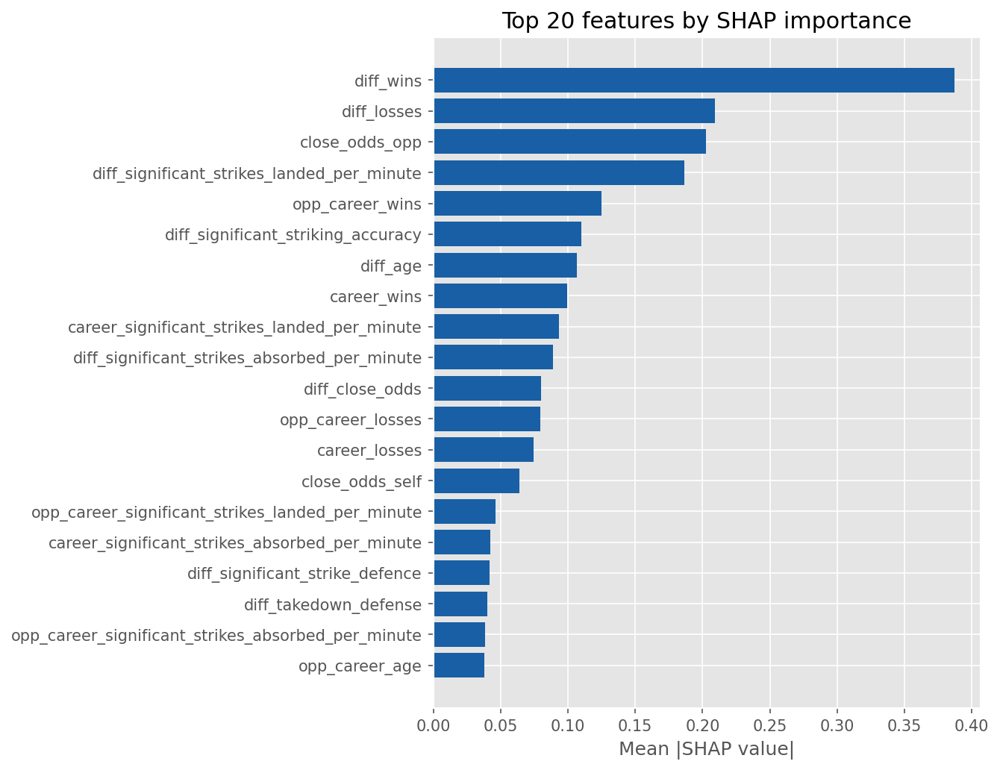

# UFC Win Predictor Model Report

## Summary

This project predicts UFC fight winners from fighter names and optional betting
odds. The production model is XGBoost because it performed better than the
PyTorch on held-out ranking metrics and is a better fit for structured
tabular data.

### Final Benchmarks

| Model | Test Accuracy | Test AUC |
| --- | ---: | ---: |
| XGBoost | 0.7020 | 0.7692 |
| PyTorch MLP | 0.6754 | 0.7426 |

The XGBoost notebook also reports `0.7715` AUC on the grouped mirrored-row test
set and `0.7796` best cross-validated AUC during hyperparameter search.

## Why This Model

XGBoost is the right production choice here for three reasons:

1. It achieved the best AUC on the held-out test set.
2. It handles the mixture of numeric, categorical, and engineered matchup
   features well.
3. It is easier to inspect and explain with SHAP than the neural baseline.

PyTorch was a valid baseline, but it required more preprocessing and tuning and
still underperformed on the main metric.

## Data And Features

The model uses UFCStats-derived fight data and BestFightOdds-derived moneylines.
Each matchup is transformed into a fighter-vs-opponent feature vector with:

- Fighter career attributes.
- Opponent career attributes.
- Lagged rolling fight-history features.
- Fighter-minus-opponent difference features.
- Odds features when available.
- An `odds_inferred` flag for incomplete odds rows.

Rolling features are shifted so only prior fights contribute to the current
row. That prevents future leakage.

## Validation Approach

The notebooks use bout-grouped splits so the mirrored rows for a single fight
stay in the same train/validation/test partition. That is important because
each bout is represented from both fighter perspectives.

The XGBoost notebook also uses:

- Optuna hyperparameter search.
- GroupKFold cross-validation.
- Early stopping.
- Calibration plotting.
- Tree SHAP feature importance.

## Visuals

### XGBoost Training Curves

### PyTorch Training Curves

### Calibration

### SHAP Importance

## Interpretation

The most important practical consequence is that the model predicts in both
fight directions and averages the results. That keeps probabilities symmetric
and makes the output independent of input order.

The calibration plot matters because the app is used for edge detection against
market prices. A model with good ranking but poor calibration would be much
less useful in that setting.

## Conclusion

XGBoost is the production model because it produces the strongest AUC, fits
the tabular feature space, and remains interpretable enough for a betting
adjacent workflow.

For a deeper implementation walkthrough, see [the modeling appendix](./modeling.md).
